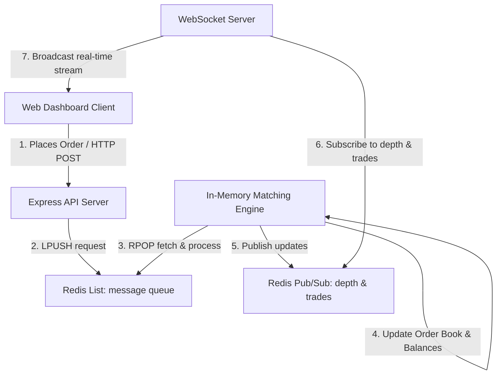

# 🏦 EXCHANGE – High-Performance Matching Engine & Terminal

A secure, high-throughput, and event-driven digital asset exchange system built in TypeScript and powered by Redis and WebSockets. Designed to demonstrate low latency order matching and real-time visualization principles.

---

## 📊 Live Performance Benchmarks (Load Test Results)

We ran a high-concurrency stress test firing simultaneous Limit Orders (Buy & Sell) on the order book. The system achieved sub-15ms average latencies with 100% transactional integrity:

| Metric | Benchmark Value |
| --- | --- |
| **Total Requests Processed** | 3,648 orders |
| **Successful Matches/Placements** | 3,648 (100.0%) |
| **Failed Requests** | 0 (0.0%) |
| **Test Duration** | 5.08 seconds |
| **System Throughput** | **718.82 ops/sec** |
| **Average Roundtrip Latency** | **13.75 ms** |
| **P95 Latency** | **27.00 ms** |
| **P99 Latency** | **33.00 ms** |

---

## 🧠 System Architecture

The exchange uses an asynchronous, decoupled, event-driven architecture to keep matching operations in-memory for speed while allowing high-throughput user traffic:



### Request & Trade Flow Step-by-Step

1. **Client -> API Server**: A trader submits a buy/sell limit order from the web dashboard.
2. **API Server -> Redis Queue**: The API server validates the input, generates a unique request/client ID, and serializes the command onto the Redis `message` list. The HTTP request blocks, subscribing to a Redis channel named after the request ID.
3. **Queue -> Matching Engine**: The Matching Engine popped from the Redis list sequentially (using a non-blocking queue loop with a slight backoff).
4. **Order Book Execution**: The Engine checks user balances, matches bids and asks, updates user balances, and pushes the matched fills or open orders.
5. **Engine -> Response/PubSub**:
   - The engine publishes the request outcome directly to the request ID channel (resolving the API server's blocked HTTP handler).
   - The engine publishes the new order book depth to `depth@SOL_USDC` and matching fills to `trades@SOL_USDC`.
6. **PubSub -> WebSocket Server**: The WebSocket server receives the published updates from Redis in real time.
7. **WebSocket -> Clients**: The WebSocket server broadcasts updates to all connected browser clients.

---

## 🛠️ Tech Stack & Folder Structure

- **Backend Framework**: Express.js with Node.js
- **Database/Broker**: Redis (used for queueing and pub/sub messaging)
- **Language**: TypeScript (Type-safe compilation for ESM/NodeNext)
- **Real-time Gateway**: `ws` WebSocket library
- **Frontend Dashboard**: Next.js (App Router), Vanilla CSS Modules, and Lucide React

### Directory layout
```text
exchange/
├── api/                    # HTTP API gateway (Express)
├── engine/                  # Orderbook and Matching Logic
├── websocket/               # Real-time WebSockets Pub/Sub Server
├── frontend/                # Next.js Trading Terminal Dashboard
├── kubernetes/              # Docker Compose and Deployment configurations
└── load-test.js             # High-concurrency performance benchmark script
```

---

## 🚀 Getting Started

### Prerequisites

- [Node.js](https://nodejs.org/) (v20+)
- [Docker](https://www.docker.com/) (for running Redis)

### 1. Start Redis
```bash
docker-compose -f kubernetes/docker-compose.yml up -d redis
```

### 2. Run Local Development Servers

In three separate terminal windows, run the following commands:

```bash
# Start API Gateway (Port 3000)
cd api && npm install && npm run build && npm run start

# Start Matching Engine
cd engine && npm install && npm run build && npm run start

# Start WebSocket server (Port 3002)
cd websocket && npm install && npm run build && npm run start
```

### 3. Run the Trading Dashboard

```bash
cd frontend && npm install && npm run build && npm run start
```
Open [http://localhost:3000](http://localhost:3000) (or the designated next.js port) in your browser.

### 4. Run the Load Test
```bash
node load-test.js 5 10
```
This runs a 5-second stress test with a concurrency of 10 workers.
